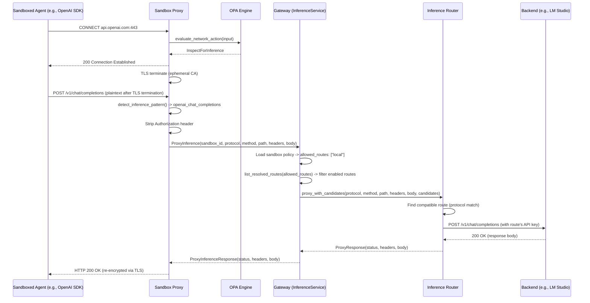
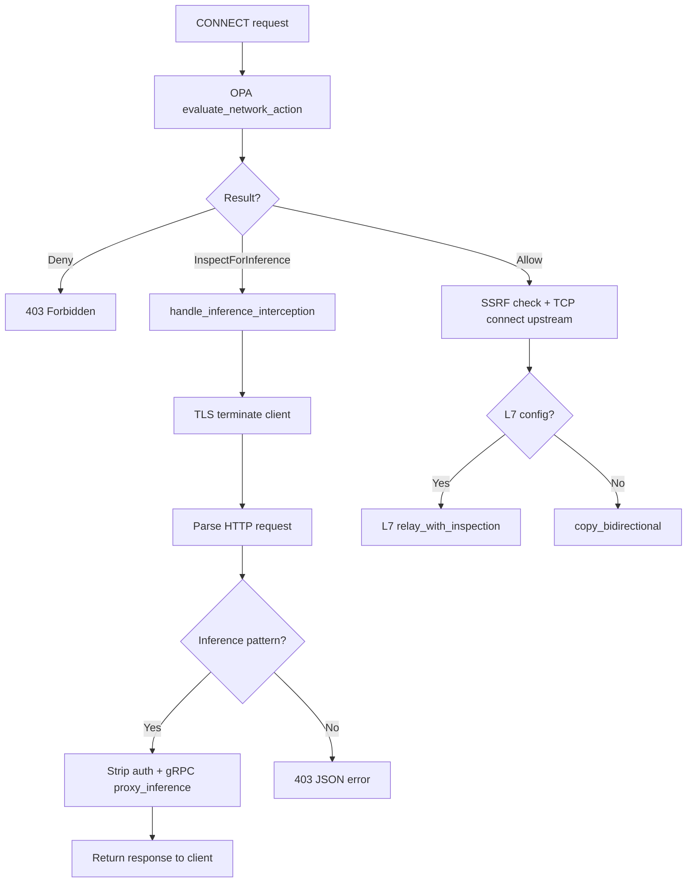

# Inference Routing

The inference routing system transparently intercepts AI inference API calls from sandboxed processes and reroutes them through the gateway to policy-controlled backends. This allows organizations to redirect SDK calls (OpenAI, Anthropic) to local or self-hosted inference servers without modifying the agent's code. The system spans three crates: `navigator-sandbox` (interception), `navigator-server` (policy evaluation and dispatch), and `navigator-router` (backend HTTP proxying).

## Source File Index

| File | Purpose |
|------|---------|
| `crates/navigator-sandbox/src/l7/inference.rs` | `InferenceApiPattern`, `detect_inference_pattern()`, HTTP request/response parsing for intercepted connections |
| `crates/navigator-sandbox/src/proxy.rs` | `InferenceContext`, `handle_inference_interception()` -- proxy-side interception logic |
| `crates/navigator-sandbox/src/grpc_client.rs` | `proxy_inference()` -- forwards intercepted requests to the gateway via gRPC |
| `crates/navigator-sandbox/src/opa.rs` | `NetworkAction` enum, `evaluate_network_action()` -- tri-state routing decision |
| `crates/navigator-server/src/inference.rs` | `InferenceService` gRPC implementation -- route CRUD and proxy dispatch |
| `crates/navigator-router/src/lib.rs` | `Router` -- protocol-based route selection and request forwarding |
| `crates/navigator-router/src/backend.rs` | `proxy_to_backend()` -- HTTP request forwarding with auth header rewriting |
| `crates/navigator-router/src/config.rs` | `RouterConfig`, `RouteConfig`, `ResolvedRoute` -- route configuration types |
| `crates/navigator-router/src/mock.rs` | Mock route support (`mock://` scheme) for testing |
| `proto/inference.proto` | Protobuf definitions: `InferenceRoute`, `InferenceRouteSpec`, `ProxyInference` RPC |
| `proto/sandbox.proto` | `InferencePolicy` message (field on `SandboxPolicy`) |
| `dev-sandbox-policy.rego` | `network_action` Rego rule -- tri-state decision logic |

## End-to-End Flow

An inference routing request passes through five components: the sandboxed agent, the sandbox proxy, the OPA engine, the gateway's `InferenceService`, and the inference router. The following diagram traces a complete request from an OpenAI SDK call inside the sandbox through to a local LM Studio backend.



## Tri-State Network Decision

The OPA engine evaluates every CONNECT request and returns one of three routing actions via the `network_action` rule. This replaces the binary allow/deny model with a third option that triggers inference interception.

### `NetworkAction` enum

**File:** `crates/navigator-sandbox/src/opa.rs`

```rust
pub enum NetworkAction {
    Allow { matched_policy: Option<String> },
    InspectForInference { matched_policy: Option<String> },
    Deny { reason: String },
}
```

### Decision logic

The `evaluate_network_action()` method evaluates `data.navigator.sandbox.network_action` and maps the string result:

| Rego result | Rust variant | Meaning |
|-------------|--------------|---------|
| `"allow"` | `NetworkAction::Allow` | Endpoint + binary explicitly matched a `network_policies` entry |
| `"inspect_for_inference"` | `NetworkAction::InspectForInference` | No policy match, but `data.inference.allowed_routes` is non-empty |
| `"deny"` (default) | `NetworkAction::Deny` | No match and no inference routing configured |

### Rego rules

**File:** `dev-sandbox-policy.rego`

```rego
default network_action := "deny"

# Explicitly allowed: endpoint + binary match in a network policy.
network_action := "allow" if {
    network_policy_for_request
}

# Binary not explicitly allowed + inference configured -> inspect.
network_action := "inspect_for_inference" if {
    not network_policy_for_request
    count(data.inference.allowed_routes) > 0
}
```

The `inspect_for_inference` rule fires when the connection does not match any network policy but the sandbox has at least one configured inference route. This covers both unknown endpoints (e.g., `api.openai.com` not in any policy) and known endpoints where the calling binary is not in the allowed list.

## Inference API Pattern Detection

**File:** `crates/navigator-sandbox/src/l7/inference.rs`

The `InferenceApiPattern` struct defines method + path combinations that identify inference API calls. `default_patterns()` returns the built-in set:

| Method | Path | Protocol | Kind |
|--------|------|----------|------|
| `POST` | `/v1/chat/completions` | `openai_chat_completions` | `chat_completion` |
| `POST` | `/v1/completions` | `openai_completions` | `completion` |
| `POST` | `/v1/messages` | `anthropic_messages` | `messages` |

`detect_inference_pattern()` strips query strings before matching (splitting on `?`). Matching is method-case-insensitive and path-exact -- no glob patterns. Only the path portion (before `?`) is compared against `path_glob`.

```rust
pub fn detect_inference_pattern<'a>(
    method: &str,
    path: &str,
    patterns: &'a [InferenceApiPattern],
) -> Option<&'a InferenceApiPattern> {
    let path_only = path.split('?').next().unwrap_or(path);
    patterns
        .iter()
        .find(|p| method.eq_ignore_ascii_case(&p.method) && path_only == p.path_glob)
}
```

## Proxy-Side Interception

**File:** `crates/navigator-sandbox/src/proxy.rs`

When OPA returns `InspectForInference`, the proxy calls `handle_inference_interception()` instead of connecting to the upstream server. The proxy never establishes a connection to the original target.

### `InferenceContext`

```rust
pub struct InferenceContext {
    pub gateway_endpoint: String,
    pub sandbox_id: String,
    pub patterns: Vec<InferenceApiPattern>,
}
```

Built at sandbox startup in `crates/navigator-sandbox/src/lib.rs` when both `sandbox_id` and `navigator_endpoint` are available. The patterns come from `l7::inference::default_patterns()`.

### `handle_inference_interception()` flow

1. **Validate prerequisites**: Both `InferenceContext` (gateway endpoint, sandbox ID, patterns) and `ProxyTlsState` (ephemeral CA) must be present. Missing either is a fatal error for the connection.

2. **TLS-terminate the client**: Call `tls_terminate_client()` to present an ephemeral leaf certificate for the original target host (e.g., `api.openai.com`). The sandboxed SDK sees a valid TLS connection via the sandbox CA that was injected into its trust store at startup.

3. **Read HTTP requests in a loop** (supports HTTP keep-alive):
   - Read into a 64 KiB buffer (`65536` bytes). If the buffer fills before a complete request is parsed, return a `431 Request Too Large` response.
   - Parse the request using `try_parse_http_request()` which extracts method, path, headers, and body. Both `Content-Length` and `Transfer-Encoding: chunked` request framing are supported (chunked bodies are decoded before forwarding).

4. **For each parsed request**:
    - If `detect_inference_pattern()` matches:
      - Strip credential and framing/hop-by-hop headers (`Authorization`, `x-api-key`, `host`, `content-length`, `transfer-encoding`, etc.) so forwarded framing is always rebuilt safely
      - Forward via `grpc_client::proxy_inference()` to the gateway
      - Return the gateway's response to the client (response hop-by-hop and framing headers are stripped before formatting)
   - If no pattern matches:
     - Return a `403` JSON error: `{"error": "only inference API calls are allowed on this connection"}`
   - If the gateway call fails:
     - Return a `502` JSON error: `{"error": "inference routing failed: {details}"}`

5. **Shift the buffer** for the next request (supports pipelining within the connection).

### Integration with the proxy decision flow

The interception path branches from `handle_tcp_connection()` after OPA evaluation:



## gRPC Transport

**File:** `crates/navigator-sandbox/src/grpc_client.rs`

`proxy_inference()` creates an `InferenceClient` connection to the gateway endpoint and sends a `ProxyInferenceRequest`:

```rust
pub async fn proxy_inference(
    endpoint: &str,
    sandbox_id: &str,
    source_protocol: &str,
    http_method: &str,
    http_path: &str,
    http_headers: Vec<(String, String)>,
    http_body: Vec<u8>,
) -> Result<ProxyInferenceResponse>
```

Headers are converted to `HttpHeader` proto messages. A new gRPC connection is established per request (no persistent connection pooling).

## Gateway Inference Service

**File:** `crates/navigator-server/src/inference.rs`

`InferenceService` implements the `Inference` gRPC service defined in `proto/inference.proto`. It holds a reference to `ServerState` which contains the persistence `Store` and an optional `Router`.

### ProxyInference RPC

The main entry point for inference routing. Processes requests from sandbox proxies.

1. **Validate** `sandbox_id` is present (else `INVALID_ARGUMENT`).

2. **Load the sandbox** from the store via `get_message::<Sandbox>()`. Returns `NOT_FOUND` if the sandbox does not exist.

3. **Extract the inference policy**: Navigate `sandbox.spec.policy.inference`. If the `inference` field is absent, return `PERMISSION_DENIED` ("sandbox has no inference policy configured"). If `allowed_routes` is empty, return `PERMISSION_DENIED` ("sandbox inference policy has no allowed routes").

4. **Resolve routes** via `list_resolved_routes()`:
   - Fetch all `InferenceRoute` records from the store (up to 500)
   - Decode each from protobuf
   - Filter: `enabled == true` AND `routing_hint` is in `allowed_routes`
   - Normalize and deduplicate protocols per route
   - Skip routes with no valid protocols after normalization
   - Return `Vec<ResolvedRoute>`

5. **Check candidates**: If no routes matched, return `FAILED_PRECONDITION` ("no enabled routes available for sandbox policy").

6. **Proxy the request**: Pass the resolved routes to `Router::proxy_with_candidates()`.

7. **Return the response**: Convert `ProxyResponse` to `ProxyInferenceResponse` (status code, headers, body).

### Route CRUD RPCs

| RPC | Behavior |
|-----|----------|
| `CreateInferenceRoute` | Validates spec, normalizes protocols (lowercase + dedupe), auto-generates name if empty (via `generate_name()`), checks for name uniqueness, assigns UUID, persists |
| `UpdateInferenceRoute` | Looks up existing route by name, preserves the stored `id`, replaces the spec |
| `DeleteInferenceRoute` | Deletes by name via `delete_by_name()`, returns `deleted: bool` |
| `ListInferenceRoutes` | Paginated list (default limit 100), decodes protobuf from store records |

### Route validation

`validate_route_spec()` checks that all required fields are non-empty:

- `routing_hint` -- the label that sandbox policies reference
- `base_url` -- backend endpoint URL
- `protocols` -- at least one protocol after normalization
- `api_key` -- authentication credential for the backend
- `model_id` -- model identifier to use

### Protocol normalization

`normalize_route_protocols()` transforms the protocol list: trim whitespace, convert to lowercase, remove duplicates (preserving insertion order), remove empty entries.

## Inference Router

**File:** `crates/navigator-router/src/lib.rs`

The `Router` struct holds a `reqwest::Client` with a 60-second timeout and an optional set of static routes (used for config-file-based routing, not the dynamic gRPC path).

### Route selection

`proxy_with_candidates()` takes a `source_protocol` (e.g., `"openai_chat_completions"`) and an externally-provided list of `ResolvedRoute` candidates. It:

1. Normalizes `source_protocol` to lowercase.
2. Finds the **first** candidate whose `protocols` list contains an exact match.
3. Returns `NoCompatibleRoute` if no candidate matches.

```rust
let route = candidates
    .iter()
    .find(|r| r.protocols.iter().any(|p| p == &normalized_source))
    .ok_or_else(|| RouterError::NoCompatibleRoute(source_protocol.to_string()))?;
```

### Mock route support

**File:** `crates/navigator-router/src/mock.rs`

Routes with a `mock://` endpoint scheme return canned responses without making HTTP calls. Mock responses are protocol-aware:

| Protocol | Response shape |
|----------|---------------|
| `openai_chat_completions` | Valid OpenAI chat completion JSON |
| `openai_completions` | Valid OpenAI text completion JSON |
| `anthropic_messages` | Valid Anthropic messages JSON |
| Other | Generic JSON with `mock: true` |

All mock responses include an `x-navigator-mock: true` header and use the route's `model` field in the response body.

### Backend proxying

**File:** `crates/navigator-router/src/backend.rs`

`proxy_to_backend()` forwards the HTTP request to the real backend:

1. **Construct URL**: `{route.endpoint.trim_end('/')}{path}` (e.g., `http://localhost:1234/v1` + `/chat/completions` = `http://localhost:1234/v1/chat/completions`). Note: the path from the original request is appended as-is. If the route's `base_url` already includes the API prefix, the path may double up -- route configuration should account for this.

2. **Set Authorization**: `Bearer {route.api_key}` via `builder.bearer_auth()`.

3. **Forward headers**: All headers except `authorization` and `host` are forwarded from the original request.

4. **Timeout**: 60 seconds (set at `Client` construction time).

5. **Error classification**:

| Condition | Error variant |
|-----------|--------------|
| Request timeout | `RouterError::UpstreamUnavailable` |
| Connection failure | `RouterError::UpstreamUnavailable` |
| Response body read failure | `RouterError::UpstreamProtocol` |
| Invalid HTTP method | `RouterError::Internal` |
| Other request errors | `RouterError::Internal` |

## Data Model

### InferenceRoute (protobuf)

**File:** `proto/inference.proto`

```protobuf
message InferenceRoute {
  string id = 1;              // UUID, assigned at creation
  InferenceRouteSpec spec = 2;
  string name = 3;            // Human-friendly, unique per object type
}

message InferenceRouteSpec {
  string routing_hint = 1;    // Label for policy matching (e.g., "local")
  string base_url = 2;        // Backend endpoint URL
  repeated string protocols = 3; // Supported protocols (e.g., ["openai_chat_completions"])
  string api_key = 4;         // API key for the backend
  string model_id = 5;        // Model identifier
  bool enabled = 6;           // Whether route is active
}
```

Persisted in the `objects` table with `object_type = "inference_route"`, using protobuf encoding.

### InferencePolicy (protobuf)

**File:** `proto/sandbox.proto`

```protobuf
message InferencePolicy {
  repeated string allowed_routes = 1; // e.g., ["local", "frontier"]
}
```

A field on `SandboxPolicy`, referenced by the OPA engine as `data.inference.allowed_routes`.

### ResolvedRoute (Rust)

**File:** `crates/navigator-router/src/config.rs`

```rust
pub struct ResolvedRoute {
    pub routing_hint: String,
    pub endpoint: String,
    pub model: String,
    pub api_key: String,
    pub protocols: Vec<String>,
}
```

Created by `list_resolved_routes()` in the gateway from `InferenceRoute` records. Contains only the fields needed for routing -- no ID or name.

### ProxyInferenceRequest/Response (protobuf)

**File:** `proto/inference.proto`

```protobuf
message ProxyInferenceRequest {
  string sandbox_id = 1;
  string source_protocol = 2;     // e.g., "openai_chat_completions"
  string http_method = 3;         // e.g., "POST"
  string http_path = 4;           // e.g., "/v1/chat/completions"
  repeated HttpHeader http_headers = 5;
  bytes http_body = 6;
}

message ProxyInferenceResponse {
  int32 http_status = 1;
  repeated HttpHeader http_headers = 2;
  bytes http_body = 3;
}
```

## Policy Configuration

### Sandbox policy (YAML)

The `inference` key in a sandbox policy YAML file controls which routes the sandbox can use:

```yaml
inference:
  allowed_routes:
    - local        # Matches routes with routing_hint "local"
    - frontier     # Matches routes with routing_hint "frontier"
```

When `allowed_routes` is non-empty, the OPA engine returns `inspect_for_inference` for any connection that does not explicitly match a `network_policies` entry. When `allowed_routes` is empty or the `inference` key is absent, unmatched connections are denied.

### Server-side route (managed via CLI)

Routes are stored in the gateway's database and managed via the `nav inference` CLI commands or the gRPC API:

```
routing_hint: local
base_url: http://localhost:1234/v1
protocols: [openai_chat_completions]
api_key: lm-studio
model_id: meta/llama-3.1-8b-instruct
enabled: true
```

The `routing_hint` field connects sandbox policy to server-side routes: a sandbox with `allowed_routes: ["local"]` can use any enabled route whose `routing_hint` is `"local"`.

## CLI Commands

**File:** `crates/navigator-cli/src/main.rs` (command definitions), `crates/navigator-cli/src/run.rs` (implementations)

| Command | Description |
|---------|-------------|
| `nav inference create` | Create an inference route. Accepts `--routing-hint`, `--base-url`, `--protocols`, `--api-key`, `--model-id`, `--disabled`. Auto-generates a name. |
| `nav inference update` | Update an existing route by name. Same flags as create. |
| `nav inference delete` | Delete one or more routes by name. |
| `nav inference list` | List all routes. Supports `--limit` (default 100) and `--offset`. |

The `create` and `update` commands perform protocol auto-detection when `--protocols` is not specified: they probe the backend URL with the provided API key and model to determine supported protocols, showing a spinner during the process.

## Error Handling

### Proxy-side errors

| Condition | Behavior |
|-----------|----------|
| `InferenceContext` missing | Error: "InspectForInference requires inference context (gateway endpoint + sandbox_id)" |
| TLS state not configured | Error: "InspectForInference requires TLS state for client termination" |
| Request exceeds 64 KiB buffer | `431` response to client |
| Non-inference request on intercepted connection | `403` JSON error: `{"error": "only inference API calls are allowed on this connection"}` |
| Gateway `ProxyInference` call fails | `502` JSON error: `{"error": "inference routing failed: {details}"}` |

### Gateway-side errors

| Condition | gRPC status |
|-----------|-------------|
| Empty `sandbox_id` | `INVALID_ARGUMENT` |
| Sandbox not found | `NOT_FOUND` |
| Sandbox has no inference policy | `PERMISSION_DENIED` |
| Inference policy has empty `allowed_routes` | `PERMISSION_DENIED` |
| No enabled routes match `allowed_routes` | `FAILED_PRECONDITION` |
| Router not configured on server | `UNAVAILABLE` |
| No route supports source protocol | `FAILED_PRECONDITION` (via `NoCompatibleRoute`) |

### Router-side errors

| Condition | `RouterError` variant | gRPC mapping |
|-----------|----------------------|--------------|
| No compatible route for protocol | `NoCompatibleRoute` | `FAILED_PRECONDITION` |
| Backend timeout (60s) | `UpstreamUnavailable` | `UNAVAILABLE` |
| Backend connection failure | `UpstreamUnavailable` | `UNAVAILABLE` |
| Response body read failure | `UpstreamProtocol` | `INTERNAL` |
| Invalid HTTP method | `Internal` | `INTERNAL` |

## Cross-References

- [Sandbox Architecture](sandbox.md) -- Proxy, OPA engine, TLS termination, `NetworkAction` integration
- [Gateway Architecture](gateway.md) -- gRPC service hosting, `ServerState`, persistence store
- [Policy Language](security-policy.md) -- Rego rules including `network_action`
- [Overview](README.md) -- System-wide context
